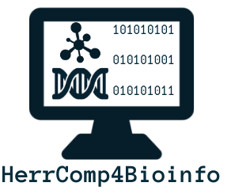

# _HerrComp4Bioinfo_: un recurso educativo de código abierto de herramientas computacionales para entusiastas de la Bioinformática

Bienvenido al repositorio de GitHub del proyecto _HerrComp4Bioinfo_. Aquí es donde se desarrollan, revisan y mantienen todos los componentes del proyecto.

La versión en inglés de este README está disponible [aquí](README_ENGLISH.md).

**Tabla de contenidos:**

- [Sobre el proyecto](#sobre-el-proyecto)
- [Contenidos](#contenidos)
- [El equipo](#el-equipo)
- [¿Cómo contribuir?](#como-contribuir)
- [Contacto](#contacto)

## Sobre el proyecto

En general, la **Bioinformática** es la aplicación de herramientas computacionales para comprender datos biológicos. Debido a la naturaleza interdisciplinaria de la Bioinformática, sus profesionales deben poseer una amplia gama de conocimientos sobre Biología, Informática y Matemáticas. Tradicionalmente, las personas de las áreas de las ciencias biológicas no han tenido una formación adecuada en programación, uso de terminal, entre otras herramientas computacionales útiles para trabajar en Bioinformática.

Existen algunas iniciativas para ayudar a los entusiastas de la Bioinformática a aprender las habilidades computacionales fundamentales para trabajar en esta disciplina. Algunos ejemplos de recursos abiertos y en línea con este fin son [Rosalind](http://rosalind.info/about/), [Software Carpentry](https://software-carpentry.org/lessons/), entre otros. Sin embargo, la mayoría de estos recursos educacionales están escritos en inglés, por lo que para muchas personas cuya lengua nativa no es el inglés podría ser difícil aprovechar estos materiales.

Especificamente, hemos identificado **la falta de recursos educativos unificados y de alta calidad para Bioinformática escritos en español**. Aunque hay algunos cursos de Bioinformática que se imparten en español, los precios para asistir a estos eventos pueden ser restrictivos para muchos interesados. En este escenario, desarrollamos _HerrComp4Bioinfo_, **un recurso educativo de código abierto de herramientas computacionales para entusiastas de la Bioinformática escrito en español**. De esta forma, nuestros usuarios pueden desarrollar habilidades importantes para comenzar sus carreras en esta área de investigación, a pesar de las posibles barreras del idioma.

Estamos trabajando de forma abierta porque de esta manera nuestro proyecto puede ser apoyado por la comunidad y podría ayudar a una audiencia más amplia. Presentamos este recurso como un libro electrónico al que puede acceder con este [enlace](https://rsg-ecuador.github.io/HerrComp4Bioinfo).

Este proyecto se basa en los contenidos de un [grupo de estudio](https://github.com/RSG-Ecuador/Grupo-De-Estudio-Linux-Bash) y un [curso](https://github.com/RSG-Ecuador/unix.bioinfo.rsgecuador) desarrollado por el Grupo de Estudiantes de Biología Computacional del Ecuador, [RSG Ecuador](https://rsg-ecuador.iscbsc.org/), parte del [Consejo de Estudiantes de la Sociedad Internacional de Biología Computacional](https://www.iscbsc.org/). Además, hemos mejorado la idea del proyecto durante la [Cuarta Cohorte de Open Life Science](https://openlifesci.org/ols-4), una iniciativa para aprender a crear y gestionar proyectos abiertos en Biología.

## Contenidos

1. Introducción a Unix y GNU/Linux
2. Jupyter Lab
3. Manejo terminal
4. Procesamiento de ficheros, regex y pipes
5. Ejercicios de procesamiento ficheros con enfoque en Bioinformática
6. Comando Make para instalar programas
7. SAM Tools: conjunto de programas útiles en Bioinformática
8. AWK: lenguaje de programación para procesamiento de archivos de texto
9. Bash como lenguaje de programación
10. Git y GitHub

## El equipo

Los fundadores de _HerrComp4Bioinfo_ son [Sebastián Ayala Ruano](https://sayalaruano.github.io/) y Juan Zurita. Este proyecto se inició con algunas actividades organizadas por el [RSG Ecuador](https://rsg-ecuador.iscbsc.org/), como se mencionó en la sección anterior. Además, el desarrollo de diferentes partes de este recurso fue apoyado por algunos voluntarios del RSG Ecuador.

Esperamos que _HerrComp4Bioinfo_ se convierta en una iniciativa impulsada por la comunidad, donde todos pueden contribuir y colaborar con el desarrollo de este recurso educativo de código abierto.

## ¿Cómo contribuir?

Te animamos a participar como colaborador en este proyecto, considerando tus intereses, disponibilidad, o habilidades. Puede encontrar información detallada sobre las formas de colaborar con este proyecto en nuestra [guía de contribución](CONTRIBUTING.md). Además, debes considerar que se espera que todos los colaboradores que se unan a _HerrComp4Bioinfo_ sigan nuestro [código de conducta](CODE_OF_CONDUCT.md).

## Contacto

Si deseas informar un problema o sugerir una mejora, debes [abrir un issue](https://github.com/RSG-Ecuador/HerrComp4Bioinfo/issues) en este repositorio de Github, y podemos seguir sus preguntas o sugerencias. Pero también puedes contactar a Sebastián enviando un correo electrónico a sebasar1245@gmail.com o por un mensaje en [Twitter](https://twitter.com/sayalaruano).
